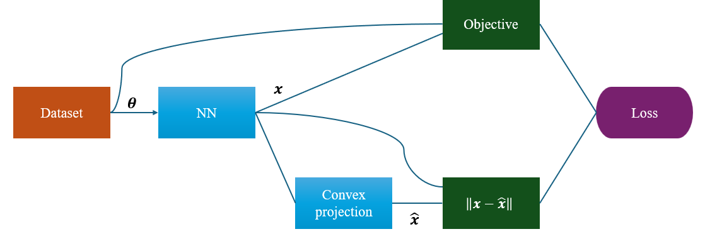

# L2O_MIQP_neuromancer

This is the repo for a simple example of learning to optimize an MIQP using neuromancer, [Notebook](https://github.com/vietanhle0101/L2O_MIQP_neuromancer/blob/main/Part7_MIQP.ipynb).

[GUROBI Optimizer](https://www.gurobi.com/solutions/gurobi-optimizer/?_gl=1*pl0xtk*_up*MQ..*_gs*MQ..&gclid=Cj0KCQjw2N2_BhCAARIsAK4pEkXqzIPHJWqmMKXiTPs5a1pqhnxooLNPJiayHsfnl3wIuqO5Ki5odGYaAn24EALw_wcB) is needed to solve MIQP for comparison. 

### Limitations of the supervised learning method for accelerating MIQP 

* Does not guarantee that the binary solution from NNs yields feasible convex problems.
* Cannot extend to learning the continuous solutions.

### Learning to Optimize

* Learning-to-optimize (L2O) leverages the problem's objective and constraints to define the loss function for training NNs.
* Based on differentiable programming to optimize the loss function.

  

### Current challenges in L2O for MIP

* Discrete operators make the problem non-differentiable, but it can be handled by straight-through estimator (STE) for rounding operator.
* Since MIP is non-convex, gradient-based methods likely converge to a local (highly suboptimal) solution. 
